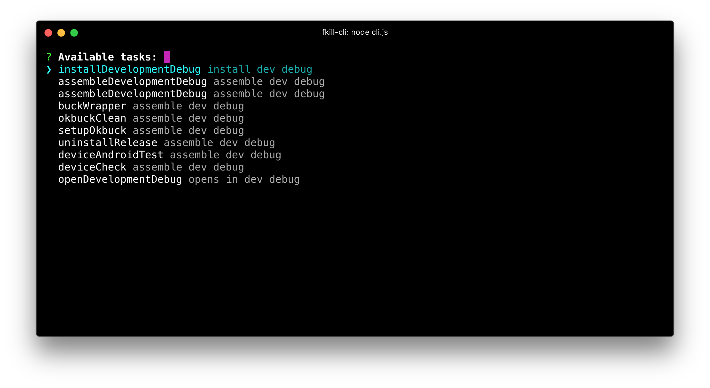

<!--<h1 align="center">
	<br>
	
	<br>
	<br>
	<br>
</h1>-->

# Gradlr
> Because finding gradle task names should be as easy as pie


<p align="center">

</p>

[](https://travis-ci.org/sindresorhus/fkill-cli)

Works on macOS, Linux, and Windows.


## Install

```
$ npm install --global gradlr-cli
```

## Usage

```
$ gradlr --help

  Usage
    $ gradlr [<pid|name> ...]

  Options
    -f, --force    Force to re-index the tasks

  Examples
    $ gradlr
    $ gradlr -f
    $ gradlr -v
```


<!--## Interactive UI

Run `fradle` without arguments to launch the interactive UI.

-->


## Created by

- [Cesar Ferreira](https://cesarferreira.com)

## License

MIT © [Cesar Ferreira](https://cesarferreira.com)
