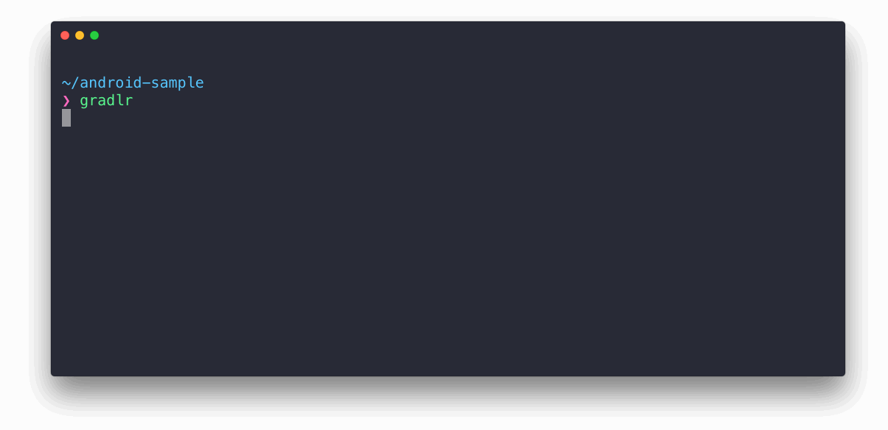

# Gradlr
> Fastest way to run your gradle tasks

<p align="center">

</p>

[](https://travis-ci.org/cesarferreira/gradlr)
[](https://www.npmjs.com/package/gradlr)
[](https://www.npmjs.com/package/gradlr)

## Install

```
$ npm install -g gradlr
```

## Usage

```
$ gradlr --help
	Usage
		$ gradlr

	Options
		-o, --offline  Execute the build without accessing network resources
		-f, --force    Force to re-index the tasks

	Examples
		$ gradlr
		$ gradlr --force
		$ gradlr --offline

Run without arguments to use the interactive interface.

```

## What happens?
First time it runs it will cache tasks so the #2 time it'll be instant.
How does it know it needs to re-index after you change something in any of the gradle files? The First time it's cached, this tool saves a checksum of the sum of checksums of all of the projects' gradle files, so it knows when you changed something and re-indexes when needed.

## Should I commit the `.tasks.cache` file?
If you commit it, your collegues will not have to index the tasks again. omg, so cool amirite?

## Created by
[Cesar Ferreira](https://cesarferreira.com)

## License
YOLO © [Cesar Ferreira](https://cesarferreira.com)
